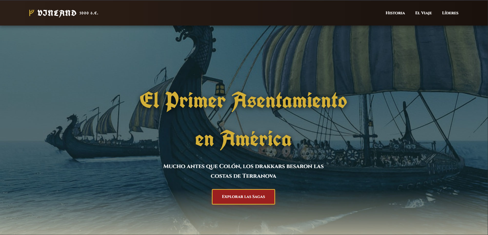

# 🪓 VINLAND: El Sueño Vikingo

**Proyecto Final con deploy | DEV.F - FrontEnd**

Una landing page épica que rinde homenaje al primer asentamiento vikingo en América. Combina historia real (Leif Erikson, Thorfinn Karlsefni, L'Anse aux Meadows) con la aclamada obra de ficción *Vinland Saga* de Makoto Yukimura.

Diseño inspirado en la era vikinga (madera, hierro, runas y pergamino) fusionado con estética moderna y animaciones fluidas.

---

## 🚀 Tecnologías Utilizadas

- **Diseño puro** con CSS Grid, Flexbox y animaciones avanzadas (flip 3D).
- **Tipografías** personalizadas: Cinzel + UnifrakturCook (estilo rúnico).
- Totalmente responsivo sin frameworks.

---

## 👤 Desarrollador

| Foto | Nombre | Rol | Redes |
| :---: | :--- | :--- | :--- |
|  | **Jonathan Caixba** | Frontend Developer |   |

---

## ✨ Características Principales

- **Diseño Épico Vikingo-Moderno**: Colores inspirados en madera, hierro, sangre y pergamino antiguo.
- **Hero impactante** con drakkar y efecto de overlay oscuro.
- **Sección Historia** con grid responsivo y efecto hover en imágenes.
- **Mapa interactivo** de las rutas vikingas.
- **Sección "Líderes y Leyendas"** dividida en dos columnas:
  - **Lado izquierdo (Histórico)**: Tarjetas flip de Thorfinn Karlsefni y Leif Erikson (estatuas reales).
  - **Lado derecho (Ficción)**: Tarjetas flip de Thorfinn del manga y portada oficial de *Vinland Saga*.
- **Tarjetas 3D Flip** con animaciones suaves y efecto de pergamino.
- **Totalmente Responsivo** (móvil, tablet y escritorio).
- **Optimizado** con transiciones CSS modernas y buenas prácticas.

---

## 📸 Vista Previa

> *Captura de la landing page completa mostrando la sección "Líderes y Leyendas"*
>   by: Jonathan Caixba 🤟🖤
